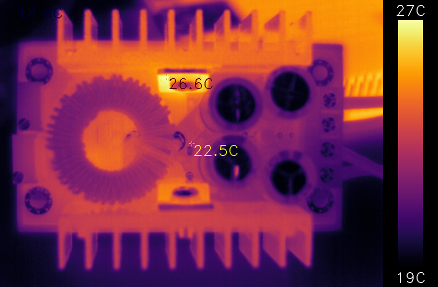

# ht301_viewer

This clone is for working on:
* support for high temperature mode of HTI-301 (400°C max instead of 120°C in default mode)
* opencv version with command line configuration options.

State of high temp mode:
* Working: high temperature mode can be activated (-m high)
* Working: switch back to low temperature mode (-m low) without reset
* Open: Correctness of temperature readings and used type switch in hacklib.

Opencv:
```
$ ./opencv.py -h
usage: opencv.py [-h] [-d DEVICE] [-c COLORMAP] [-s {1,2,3}] [-m {low,high}] [-r FROM TO] [-nl] [-nm] [--debug-dump-lut]

options:
  -h, --help            show this help message and exit
  -d DEVICE, --device DEVICE
                        video device to use (default: auto)
  -c COLORMAP, --colormap COLORMAP
                        cv2 color map used for thermal gradient (default: inferno)
  -s {1,2,3}, --scale {1,2,3}
                        scaling factor for video size (default: 2)
  -m {low,high}, --sensor-mode {low,high}
                        set sensor mode to low (120°C) or high (400°C) temperature (default: low)
  -r FROM TO, --range FROM TO
                        specify visualized temperature range (default: auto)
  -nl, --no-legend      hide color map legend
  -nm, --no-markers     hide min/max/center temperature markers
  --debug-dump-lut      Debugging: Dump temperature LUT used to convert raw data to celcius to lut_dump.csv after 20 frames.
```

